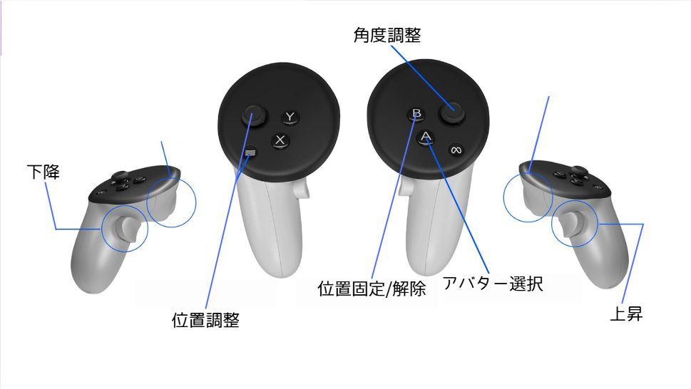
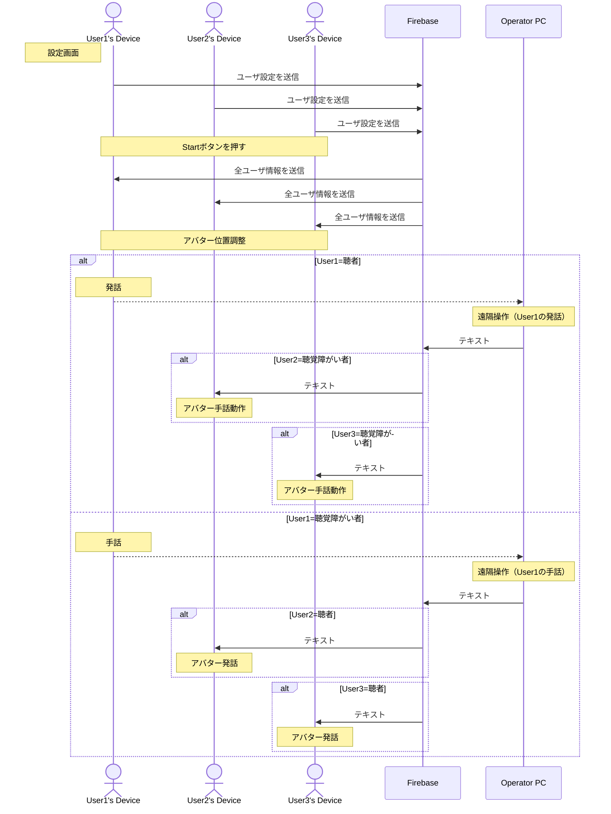
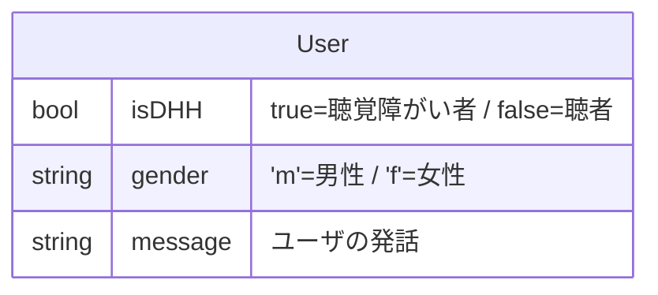

# :book: マニュアル
* [セットアップ](#セットアップ)
* [ファイル構成](#ファイル構成)
* [シーケンス図](#シーケンス図)
* [データベース設計](#データベース設計)

## セットアップ
セットアップの手順は[README](../../README.md)の通りです。

## アバターの位置調整
コントローラーでアバターの位置を調整することができます。

※アバター選択の切り替えは、ボタンを押すたびにFemale1 > Female2 > Female3 > Male1 > Male2 > Male3 > Female1......のようにループします。



## ファイル構成
```
Asset
└── Project
    ├── Animations
    │   ├── FemaleAnimatorController.controller #男性アバター用アニメーター
    │   ├── MaleAnimatorController.controller #女性アバター用アニメーター
    │   └── Mask #アニメーターで使用するマスク
    │   │   ├── Face.mask
    │   │   └── Upper.mask
    ├── Prefabs
    │   ├── Avatars #アバター情報
    │   │   ├── Female1 #女性アバター1
    │   │   │   ├── Avatar_F1.Avatar  #女性アバター1のオブジェクト
    │   │   │   ├── Avatar_F1.AvatarDescription
    │   │   │   ├── Avatar_F1.BlendShapes
    │   │   │   ├── Avatar_F1.Materials
    │   │   │   ├── Avatar_F1.Meshes
    │   │   │   ├── Avatar_F1.MetaObject
    │   │   │   └── Avatar_F1.Textures
    │   │   ├── Female2 #女性アバター2
    │   │   ├── Female3 #女性アバター3
    │   │   ├── Male1 #男性アバター1
    │   │   ├── Male2 #男性アバター2
    │   │   └── Male3 #男性アバター3
    │   └── Settings
    │   │   └── SettingsButton.prefab #設定画面内のボタンオブジェクト
    ├── Scenes
    │   ├── Production #本番用シーンを格納
    │   │   ├── MainScene.unity #メインのシーン
    │   │   └── SettingsScene.unity #設定画面シーン
    │   └── Test #開発用シーンを格納
    └── Scripts
        ├── Avatars
        │   ├── AllAvatarsManagerScript.cs #全アバターの管理（アバターのID振り分け等）
        │   ├── AvatarControllerScript.cs #各アバターの振る舞いを指定
        │   ├── AvatarPositionControllerScript.cs #アバターの位置調整
        │   ├── SignLanguage
        │   │   └── SignLanguageScript.cs #アバターの手話動作
        │   └── SpokenLanguage
        │       └── SpokenLanguageScript.cs #アバターの発話と発話動作
        ├── Firebase #Firebaseとのデータ受け渡し
        │   ├── GetGenderScript.cs #Gender値の取得
        │   ├── GetIsDHHScript.cs #IsDHH値の取得
        │   ├── InitializeFirebaseScript.cs #Firebase設定の初期化
        │   ├── ListenMessageChangedScript.cs #Message値の変更監視
        │   ├── SaveGenderScript.cs #Gender値の更新
        │   └── SaveIsDHHScript.cs #IsDHH値の更新
        ├── Scenario
        │   └── ScenarioToDict.cs #シナリオデータ成形
        └── Settings #設定画面のユーザ操作スクリプトを格納
            ├── OnButtonClickedScript.cs #ボタンクリック時の動作
            └── OnSelectUserButtonClickedScript.cs #ユーザ選択時の動作
```

## シーケンス図



## データベース設計
