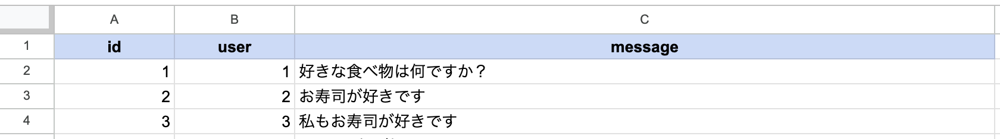

# :book: 操作画面マニュアル
* [セットアップ](#セットアップ)
* [ユーザについて](#ユーザについて)
* [シナリオファイルについて](#シナリオファイルについて)
* [各ユーザ操作画面のボタンについて](#各ユーザ操作画面のボタンについて)

## セットアップ
セットアップの手順は[README](README.md)の通りです。

## ユーザについて
* システムの使用ユーザは３人を想定しています。各ユーザ操作画面は、ホームページの [user1] [user2] [user3] のボタンから移動できます。
* ホームページに記載されている `user1` `user2` `user3` は Firebase Realtime Database の `user1` `user2` `user3` と紐づいています。
* `isDHH` は、各ユーザがDHH ( Deaf and Hard of Hearing ) かどうかのデータを示しています。

## シナリオファイルについて
1. Excelなどで下記のようなファイルを作成します。

    

    * `id`列は１から昇順に値を入力してください。
    * `user`列はどのユーザが話すかを数値で入力してください。数値（`1` `2` `3`）は Firebase Realtime Database のユーザ番号（`user1` `user2` `user3`）と紐づいています。
    * `message`列はユーザが話す内容を入力してください。ここに書いた内容が操作画面のボタンに表示される文字＆ Firebse Realtime Database に送信される文字列になります。

2. 作成したファイルをCSV形式でエクスポートしてください。
3. 各ユーザ操作画面のシナリオデータからエクスポートしたファイル（CSV形式）を選択すると、操作画面のためのボタンが表示されます。

## 各ユーザ操作画面のボタンについて
* ボタンをクリックするとFirebase Realtime Database にボタンに表示された文字列が送信されます。