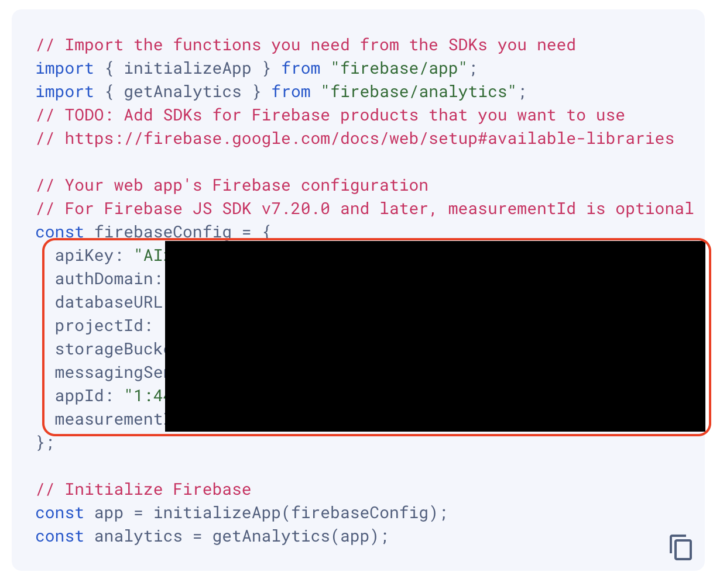
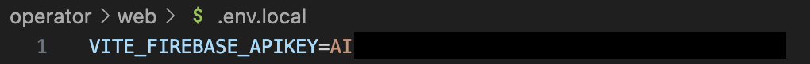

# :technologist: 操作画面の使用方法

# :books: ドキュメント
**[:rocket: クイックスタート](#rocket-クイックスタート)**
1. [:whale: Docker Desktopをインストールする](#whale-docker-desktopをインストールする)
2. [:globe_with_meridians: ウェブアプリをFirebaseに登録する](#globe_with_meridians-ウェブアプリをfirebaseに登録する)
3. [:nut_and_bolt: 環境変数を設定する](#nut_and_bolt-環境変数を設定する)
4. [:runner: 操作画面を起動する](#runner-操作画面を起動する)

**[:book: 操作画面マニュアル](Manual.md)**
* [セットアップ](Manual.md#セットアップ)
* [ユーザについて](Manual.md#ユーザについて)
* [シナリオファイルについて](Manual.md#シナリオファイルについて)
* [各ユーザ操作画面のボタンについて](Manual.md#各ユーザ操作画面のボタンについて)


# :rocket: クイックスタート
以下が操作画面のセットアップ手順です。

## :whale: Docker Desktopをインストールする
[Docker Desktop - Docker](https://www.docker.com/ja-jp/products/docker-desktop/) からDocker Desktopをインストールします。

## :globe_with_meridians: ウェブアプリをFirebaseに登録する
[アプリを登録する - Firebaseドキュメント](https://firebase.google.com/docs/web/setup?hl=ja#register-app) を参考にして、ウェブアプリをFirebaseに登録します。

1. [Firebaseコンソール](https://console.firebase.google.com/?hl=ja) から使用するプロジェクトを開き、中央にある [ウェブアイコン] をクリックして設定ワークフローを起動します。

    ※すでに Firebase プロジェクトにアプリを追加している場合は、[アプリを追加] をクリックするとプラットフォームのオプションが表示されます。

2. アプリのニックネームに任意のアプリ名を入力して、[アプリを登録] をクリックします。

## :nut_and_bolt: 環境変数を設定する
1. `operator/web/`フォルダの中に `.env.local`ファイルを作成します。

2. `.env.local` の内容を下記のように変更します。

    ```
    VITE_FIREBASE_APIKEY=firebaseのapiKey
    VITE_FIREBASE_AUTHDOMAIN=firebaseのauthDomain
    VITE_FIREBASE_DATABASEURL=firebaseのdatabaseURL
    VITE_FIREBASE_PROJECTID=firebaseのprojectId
    VITE_FIREBASE_STORAGEBUCKET=firebaseのstorageBucket
    VITE_FIREBASE_MESSAGINGSENDERID=firebaseのmessagingSenderId
    VITE_FIREBASE_APPID=firebaseのappId
    VITE_FIREBASE_MEASUREMENTID=firebaseのmeasurementId
    ```

3. `.env.local`のイコール（=）の後ろ全てをFirebaseウェブアプリの下記の値に変更します。

    </img>

    書き方の例 ）
        
    </img>


## :runner: 操作画面を起動する
1. ターミナルで `operator/` に移動します。
    ```
    cd operator/
    ```
2. Docker Desktopアプリを開きます。
2. ターミナルからDockerコンテナをビルド・起動します。
    ```
    docker compose up --build
    ```
3. コンテナが立ち上がったら、http://localhost:5173/ にアクセスします。