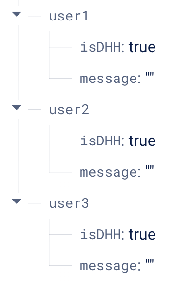
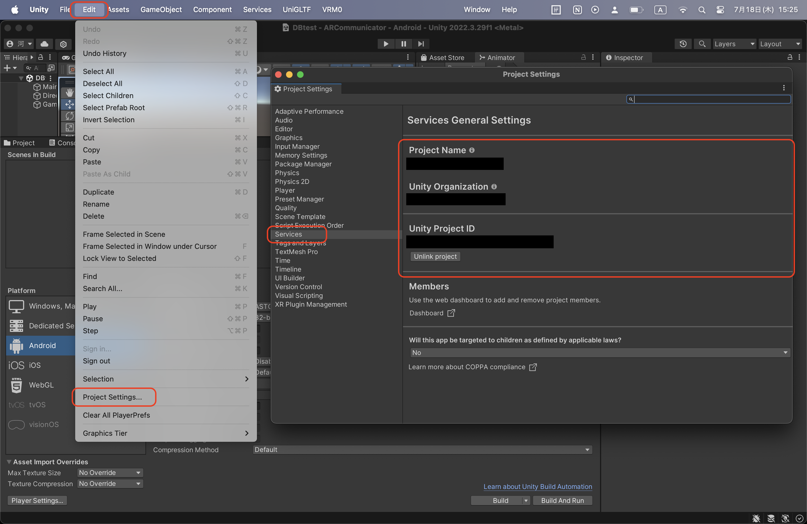
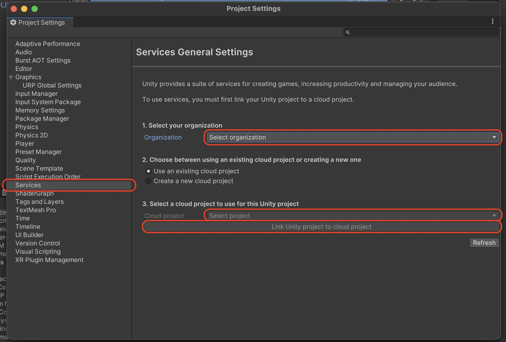
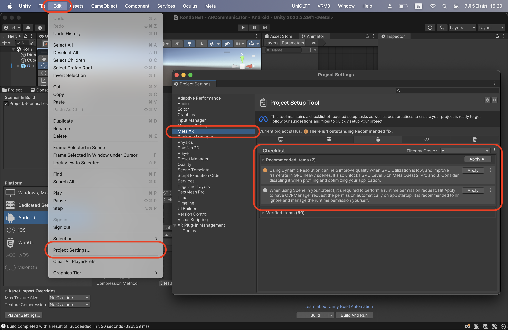
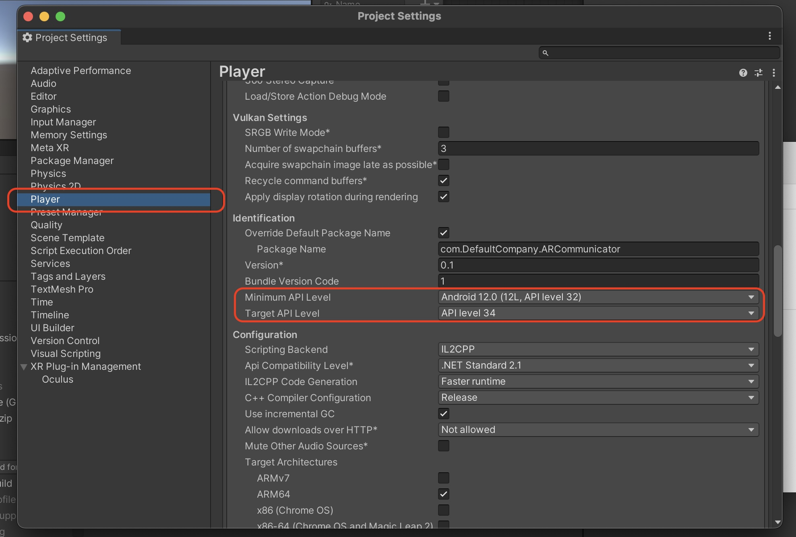

# AR Communicator For Deaf and Hearing

### 対応デバイス
* Meta Quest3

### 開発環境
* MacBook Air
* Windows 10
* Windows 11

# 📚 ドキュメント
**[:rocket: クイックスタート](#rocket-クイックスタート)**
1. [:diamond_shape_with_a_dot_inside: Unityをインストールする](#diamond_shape_with_a_dot_inside-unityをインストールする)
2. [:file_folder: プロジェクトを追加する](#file_folder-プロジェクトを追加する)
3. [:fire: Firebaseプロジェクトを作成する](#fire-firebaseプロジェクトを作成する)
4. [:fire: Firebase Realtime Databaseを作成する](#fire-firebase-realtime-databaseを作成する)
5. [:robot: AndroidアプリをFirebaseに登録する](#robot-androidアプリをfirebaseに登録する)
6. [:wrench: Firebase構成ファイルを追加する](#wrench-firebase構成ファイルを追加する)
7. [:toolbox: Firebase Unity SDKを追加する](#toolbox-firebase-unity-sdkを追加する)
8. [:vertical_traffic_light: スクリプトの実行順序を指定する](#vertical_traffic_light-スクリプトの実行順序を指定する)
9. [:package: 依存パッケージをインポートする](#package-依存パッケージをインポートする)
10. [:runner: アバターのモーションを追加する](#runner-アバターのモーションを追加する)
11. [:cloud_with_lightning: Unity Cloudと連携する](#cloud_with_lightning-unity-cloudと連携する)
12. [:hammer_and_wrench: ビルド＆実行する](#hammer_and_wrench-ビルド＆実行する)


**[:technologist: 操作画面の使用方法](Documents/Operator/README.md)**
* [:books: ドキュメント](Documents/Operator/README.md#books-ドキュメント)
* [:rocket: クイックスタート](Documents/Operator//README.md#rocket-クイックスタート)
* [:book: 操作画面マニュアル](Documents/Operator/Manual.md)


# :rocket: クイックスタート
以下が本システムのセットアップ手順です。

## :diamond_shape_with_a_dot_inside: Unityをインストールする
1. [Download the Unity Hub - Unity](https://unity.com/ja/download) からUnity Hubをダウンロードします。
2. [Unity download archive - Unity](https://unity.com/ja/releases/editor/archive) で **2022.3.29f1** バージョンのUnityをインストールします。
3. Meta Quest用にビルドするために以下のモジュールを追加します。
    * Android Build Support ( Android SDK & NDK Tools, OpenJDK )


## :file_folder: プロジェクトを追加する
1. このリポジトリをクローンします。
    ```
    git clone https://github.com/social-robotics-lab/ar-communicator-for-deaf-and-hearing.git
    ```
2. Unity HubのProjectsで、[Add] をクリックします。
3. ARCommunicatorフォルダを選択して、作成されたプロジェクトを開きます。

## :fire: Firebaseプロジェクトを作成する
> [!Note]\
> 詳しくは [Unity プロジェクトに Firebase を追加する - Firebaseドキュメント](https://firebase.google.com/docs/unity/setup?hl=ja) をご覧ください。

1. [Firebaseコンソール](https://console.firebase.google.com/?hl=ja) で [プロジェクトを追加] をクリックします。
2. 任意のプロジェクト名を入力して、[続行] をクリックします。
3. Googleアナリティクスを有効にして、Firebaseプロジェクトを作成します。
4. 処理が完了すると、[Firebaseコンソール](https://console.firebase.google.com/?hl=ja) にFirebaseプロジェクトの概要ページが表示されます。

## :fire: Firebase Realtime Databaseを作成する
> [!Note]\
> データベースは、システムを操作することで変更されるため、セットアップ時は仮の値で保存してください。\
> Firebase Realtime Databaseについては [Firebase Realtime Database - Firebaseドキュメント](https://firebase.google.com/docs/database?hl=ja) などをご覧ください。

1. プロジェクトの概要ページの [構築] から [Realtime Database] を選択します。
2. セキュリティルールで [テストモード] を選択します。

    ※セキュリティルールについての詳細は、[Firebase Realtime Databaseセキュリティルールを理解する - Firebaseドキュメント](https://firebase.google.com/docs/database/security?hl=ja) を参照してください。

3. 任意のデータベースのロケーションを選択して、[完了] をクリックします。
4. 下記のようにデータベースを設定します。

    </img>

## :robot: AndroidアプリをFirebaseに登録する
1. プロジェクトの概要ページの中央で、[Unityアイコン] をクリックして設定ワークフローを起動します。
2. [Androidアプリとして登録] にチェックを入れます。
3. Androidパッケージ名に `com.DefaultCompany.ARCommunicator` と入力します。
4. アプリのニックネームに任意のアプリ名を入力して、[アプリを登録] をクリックします。

## :wrench: Firebase構成ファイルを追加する
1. [Firebaseコンソール](https://console.firebase.google.com/?hl=ja) で`google-services.json` をダウンロードします。
2. Unityプロジェクトで、`Assets`フォルダの中に`StreamingAssets`フォルダを作成します。
3. `StreamingAssets`フォルダの中に `google-services.json`を移動します。

## :toolbox: Firebase Unity SDKを追加する
1. [Firebaseコンソール](https://console.firebase.google.com/?hl=ja) で`Firebase Unity SDK` をダウンロードし、SDKを解凍します。
2. Unityプロジェクトで、[Assets] > [Import Package] > [Custom Package] を選択します。
3. 解凍したSDKから、以下のFirebaseプロダクトを選択します。

    * FirebaseAnalytics.unitypackage
    * FirebaseDatabase.unitypackage

4. Import Unity Packageウィンドウで [Import] をクリックします。

## :package: 依存パッケージをインポートする
以下のファイルをダウンロードし、[Assets] > [Import Package] > [Custom Package] からUnityプロジェクトにインポートします。

* [UniVRM (v.110.0)](https://github.com/vrm-c/UniVRM/releases/tag/v0.110.0) **VRM 0.x**  UnityPackage
* [UniTask (v.2.5.5)](https://github.com/Cysharp/UniTask/releases/tag/2.5.5) UnityPackage

## :runner: アバターのモーションを追加する
> [!NOTE]\
> [Basic Sitting animation package](https://assetstore.unity.com/packages/3d/animations/basic-sitting-animation-package-219878) はアイドルモーションで使用しています。\
> 手話モーション Unity Package は、研究室のNASに保存されています。

1. Unity Asset Store から [Basic Sitting animation package](https://assetstore.unity.com/packages/3d/animations/basic-sitting-animation-package-219878) をプロジェクトにインポートします。
2. [Assets] > [Import Package] > [Custom Package] から **手話モーション Unity Package** をUnityプロジェクトにインポートします。

> [!WARNING]\
> モーションはインポート後に自動で設定されます。\
> 設定が反映されない場合は、`Project/Animations/` にある [Male Animation Controller] と [Female Animation Controller] にモーションを手動でアタッチしてください。

## :cloud_with_lightning: Unity Cloudと連携する
1. Unity Hubでプロジェクトの右にあるメニューバーから、[Connect to Unity Cloud] を選択します。
2. プロジェクトが [CONNECTED] に変更されたら、[CONNECTED] から [View Unity Cloud Project] を開きます。
3. Unity Cloudでプロジェクト名・組織名・プロジェクトIDを確認します。
4. Unityプロジェクトで、[Edit] > [Project Settings] > [Services] を選択して、Unity Cloudのプロジェクト名・組織名・プロジェクトIDと一致していることを確認します。

    </img>

> [!WARNING]\
> UnityプロジェクトをUnity Cloudと連携するには、Unity Cloudにあるこのプロジェクトのプロジェクトメンバーに参加しているアカウントで、Unityプロジェクトを開く必要があります。

> [!NOTE]\
> プロジェクト名・組織名・プロジェクトIDが表示されない場合は、Unityプロジェクトを再起動するか、下記の画面で [Organization] と [Cloud project] を設定し、[Link Unity project to cloud project] を選択します。\
> </img>

## :hammer_and_wrench: ビルド＆実行する
> [!IMPORTANT]\
> Meta Quest3でプロジェクトを実行するには、Meta Quest3を開発者モードに変更してください。\
> 詳しくは、[開発とテスト用にデバイスを有効にする - Oculus Developer](https://developer.oculus.com/documentation/unity/unity-enable-device/) をご覧ください。

> [!WARNING]\
> 過去に同じヘッドセットでこのプロジェクトを実行したことがある場合、ヘッドセットにこのプロジェクトのアプリ（ARCommunicator）が残っていると、ビルドに失敗する場合があります。\
> アプリの削除は、ヘッドセットで [アプリ] > [提供元不明] を選択し、 ARCommunicator の右にあるメニューバーから [アンインストール] を選択してください。

1. [Edit] > [Project Settings] > [Meta XR] > [Android] を選択します。
2. チェックリストに Outstanding Issues と Recommended Items がある場合、[Fix All] と [Apply All] を選択します。

    </img>

3. [Edit] > [Project Settings] > [Player] > [Android] > [Other Settings] を選択します。
4. Identification の Minimum API Level を [Android 12.0 (12L,API level 32)] 、Target API Level を [API level 34] に設定します。

    </img>

5. [File] > [Build Settings] > [Android] を選択し、 [Switch Platform] をクリックします。
6. USB-Cケーブルを使用してMeta Quest3をコンピューターに接続します。
7. Meta Quest3で、[Allow USB Debugging (USBデバッグを許可)]をクリックします。
8. Unityプロジェクトで、Scenes In BuildとAndroidビルド設定を以下のように変更します。

9. [Build And Run] をクリックします。